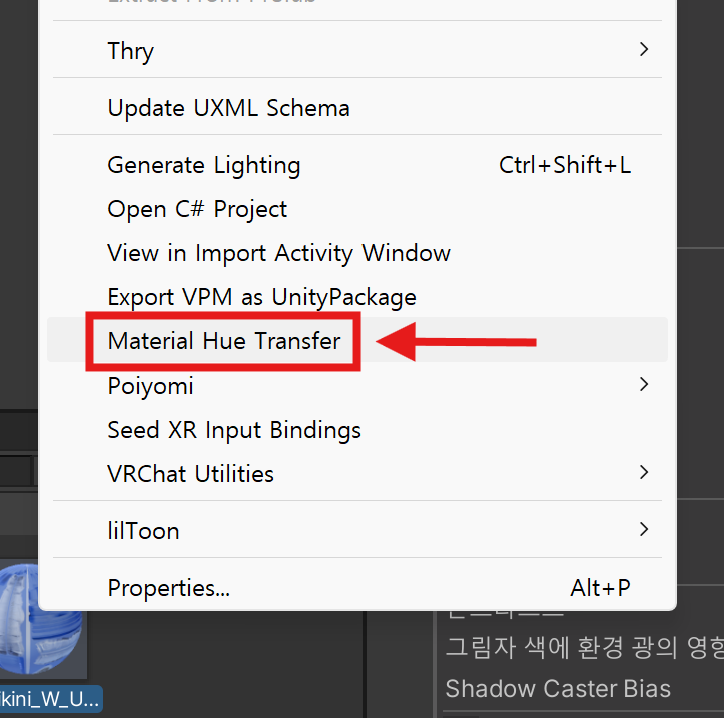
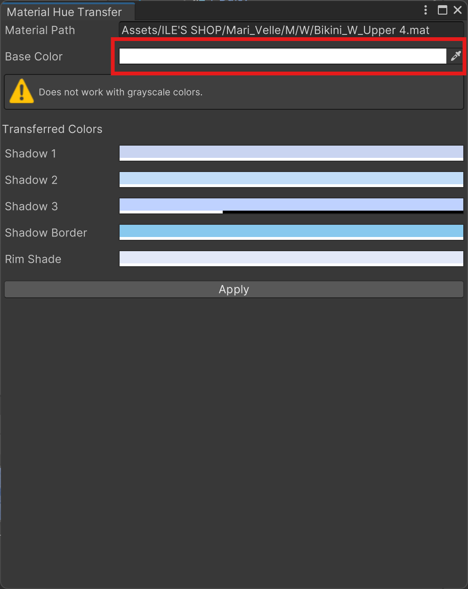
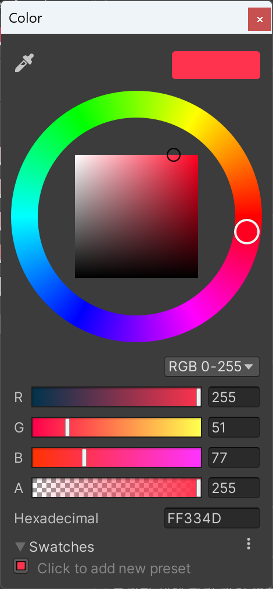
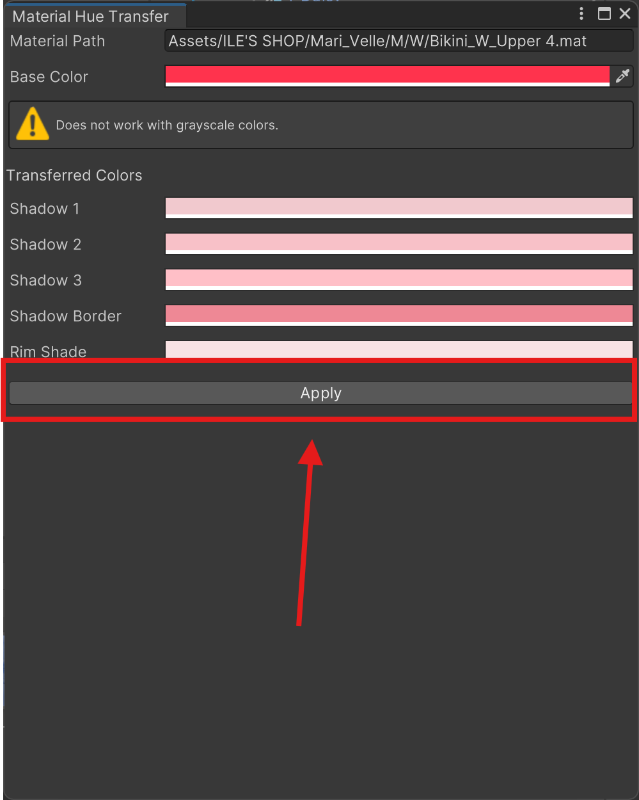
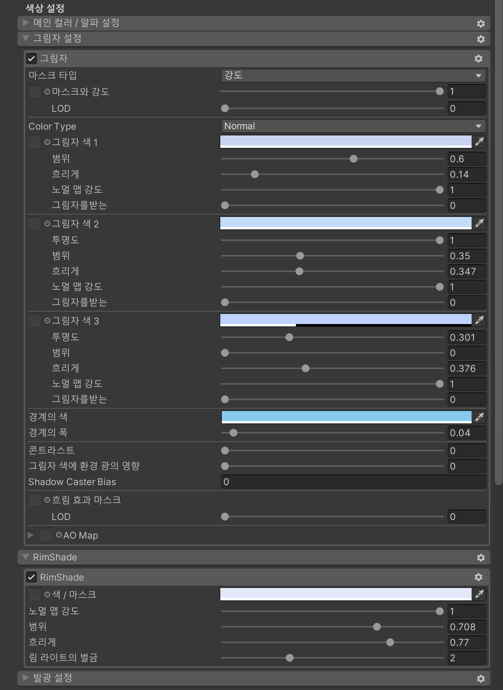
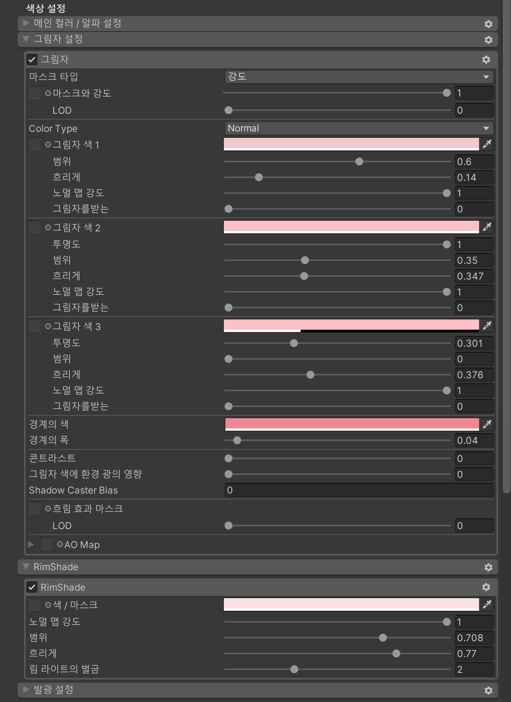
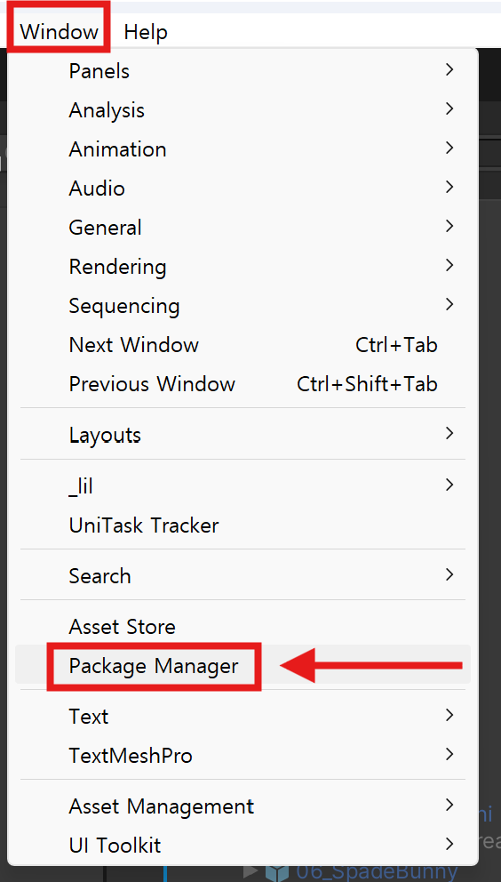
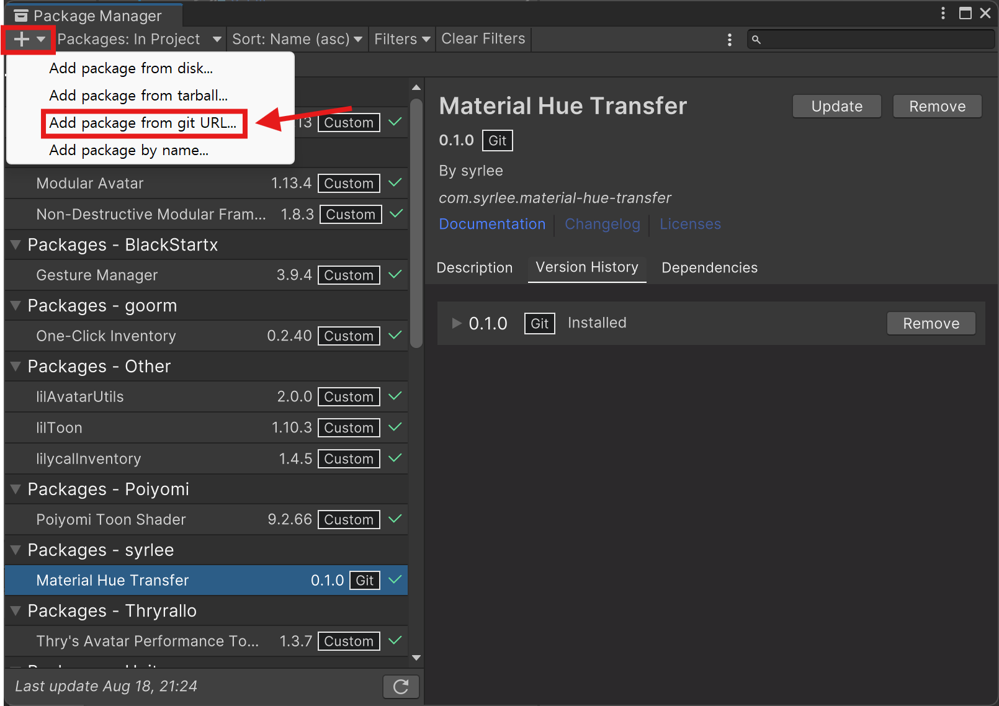
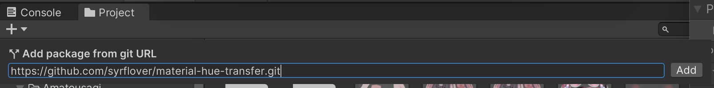

# Material Hue Transfer

Unity 에디터에서 선택한 머티리얼의 그림자 색상과 RimShade 색상을, 입력한 기준 색상의 색조(Hue)로 일괄 변환해주는 에디터 스크립트입니다.

Unity 2022.3 버전에서 작동함

## 스크린샷

<table>
    <tr>
        <td align="center">
            
        </td>
        <td align="center">
            
        </td>
        <td align="center">
            
        </td>
        <td align="center">
            
        </td>
    </tr>
</table>

<table>
    <tr>
        <td align="center">
            
        </td>
        <td align="center">
            
        </td>
    </tr>
    <tr>
        <td align="center">before</td>
        <td align="center">after</td>
    </tr>
</table>

## 설치

1. 상단 메뉴에서 `Window - Package Manager`를 선택합니다.
   

2. 왼쪽 상단에 `+` 버튼을 누르고, `Add package from git URL`을 선택합니다.
   

3. 입력창에 `https://github.com/syrflover/material-hue-transfer.git` 입력 후 `Add`를 클릭합니다.
   

## 사용법

1. 프로젝트에서 머티리얼을 하나 선택합니다.
2. Assets 메뉴에서 `Material Hue Transfer`를 클릭합니다.
3. 에디터 윈도우에서 Base Color를 조정하면, 하위 색상들의 Hue가 자동으로 동기화됩니다.
4. `Apply` 버튼을 눌러 머티리얼에 적용합니다.
